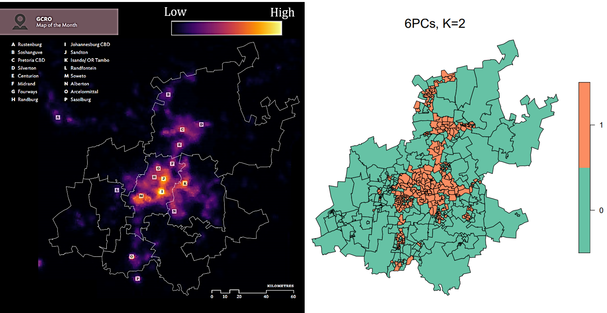

# Clustering Ward-Level Poverty Using Satellite Imagery

This is the repo for the paper ***Clustering Ward-Level Poverty Using Satellite Imagery*** by Ryan Anderson and Andomei Smit. The aim of this research is to cluster Gauteng wards based on their level of poverty and, as a result, create a poverty map. Furthermore, the clustering is purely based on publicly available data - assessing the potential for poverty mapping without the use of census data. Since high-resolution satellite imagery is publicly available, the wards will be clustered from the information that can be extracted from this imagery.

The general methodology followed in the paper is as follows:
* **Step 1:** Obtain a set of satellite images for each of the Gauteng wards
* **Step 2:** Extract a feature set for the wards from the satellite imagery using a pre-trained CNN
* **Step 3:** Reduce the dimensions of the features and then cluster using K-means and HDBSCAN

See the paper at <code>papers/Honours_Project_2020.pdf</code> for more information.

## Setup

In order to install the necessary packages, it is recommended to use the file *environment.yml*. To do this, install <a href="https://www.anaconda.com/">Anaconda</a>, then run the following command in the repo: 
```
conda env create -f environment.yml
```
Then activate the environment *honoursprojectenv* by running the following:
```
conda activate honoursprojectenv
```
Then make sure you are running a kernel associated with this environment by first running:
```
conda install -c anaconda ipykernel
```
Then run:
```
python -m ipykernel install --user --name=honoursprojectenv
```
If you get any import errors, click on the "Kernel" tab at the top of the notebook and change the kernel to the *honoursprojectenv* kernel.

Unfortunately, for the R scripts, you will have to install the necessary packages yourself.

## Scripts

The scripts can be separated into three sections: (1) feature extraction; (2) clustering; and (3) visualisation and validation. They are presented below in the order in which they should be executed.

### feature_extraction

<code>get_ward_boundaries.ipynb</code>:
Reads in the shapefile for all of the wards in South Africa and outputs the wards for each of the Gauteng municipalities.

<code>get_image_centers.ipynb</code>:
Reads in the coordinates for the Gauteng wards from the shapefiles, and computes the centers for the images that need to be extracted. This is done by sampling coordinates from a grid of images that cover the ward of interest. For an illustration, see the figure below:


<code>get_images.ipynb</code>:
Using the centers from <code>get_image_centers.ipynb</code>, this script requests three images from Google Static Maps API for each of the center coordinates - one with the ward overlayed in black and green, and one without. For each ward, the output of the algorithm is a number of image-pairs comprised of (1) a plain satellite image and (2) an image mask, with the white region of the mask outlining the area of the satellite image that falls within the ward of interest. An example can be seen below:


A <a href="https://developers.google.com/maps/documentation/maps-static/overview">Google Static Maps API</a> key is needed to request the images.

<code>get_features.ipynb</code>:
This script implements the methodology used to map each plain satellite image, with the aid of its corresponding mask, to a set of features. This involves modifiying the VGG11 model to include a "convolutional masking layer". An illustration of the modified CNN can be seen below:


### clustering

<code>pca.ipynb</code>:
This script applies PCA to the 508x4096 feature set in order to reduce the dimensions. It finds the number of principal components (PCs) to use for the remainder of the project as the first 6 (6PCs) and 18 (18PCs) principal components.

<code>kmeans_clustering.ipynb</code>:
This script applies the K-means algorithm to 6PCs and 18PCs. It used the Davies Bouldin (DB) Index, Silhouette score and Elbow method to determine K, the number of clusters to use.

<code>hdbscan_clustering.ipynb</code>:
This script applies the HDBSCAN algorithm to 6PCs and 18PCs. The DBCV index is used to determine the best cluster solution.

<code>umap_clustering.ipynb</code>:
This script explores whether implementing UMAP (instead of PCA) improves the cluster solutions obtained by HDBSCAN and K-means.


### visualisation_validation

<code>visualising_clusters.R</code>:
This script is for the visualisation of the cluster solutions obtained. Furthermore, googleway can be used to navigate the map of Gauteng to investigate the specific areas within each cluster. A <a href="https://developers.google.com/maps/documentation/maps-static/overview">Google Static Maps API</a> key is needed to view the interactive map, however, you are able to visualise the cluster solutions on a static map without a key.


<code>interpolating_sampi.R</code>:
This script interpolates the missing SAMPI values using inverse distance weighting.

<code>validating_clusters.R</code>:
This script performs an external validation of the cluster allocations obtained by K-means and HDBSCAN. It investigates the distribution of the SAMPI values first and bases the remainder of the validation analysis on the fifth root. Thereafter boxplots are created to investigate the distribution of SAMPI values within each cluster and the separability between clusters.

## Note on Scripts

The results seen in the paper can be replicated by running all of the above scripts. However, the **feature_extraction** scripts used to obtain the Gauteng feature set requires substantial run-time (downloading and processing thousands of images). To save you time, we have provided the feature sets extracted in <code>data/extracted_features/</code>. Thus, the **clustering** and **visualisation_validation** scripts can be run without running the **feature_extraction** scripts.

We have not made the SAMPI data that we used available. This data can be provided by the <a href="https://www.gcro.ac.za/">GCRO</a> on request.

## Results

Unfortunately, it is apparent that the clusters seem to merely cluster nightlight intensity and NOT poverty. For illustrative purposes, see the map of the cluster solution for K-means with K=2 (right) and the nighlight intensity of Gauteng (left) below:



When comparing the two maps, it is evident that the clusters are simply distinguishing the wards with little-to-no nightlights from the others. Since clustering nightlights does not correspond to clustering poverty (see the *External Validation* Chapter of the paper), the clusters are not useful for poverty mapping.

## Future Work

It would be interesting to see the explanatory power of the features when fitting a regression model to poverty-related data. Perhaps there exists a linear or non-linear mapping from the features to the poverty data that the clustering algorithms can't identify. Thus, feel free to use the full Gauteng feature set or any of the municipal feature sets (found at <code>data/extracted_features/</code>) for your own work.


## References

The methodology was inspired by <a href="https://github.com/nealjean/predicting-poverty">Jean et al.</a> but the pre-trained CNN was trained by <a href="https://github.com/jmather625/predicting-poverty-replication">Mather</a>. See our paper for the remainder of the references used.

