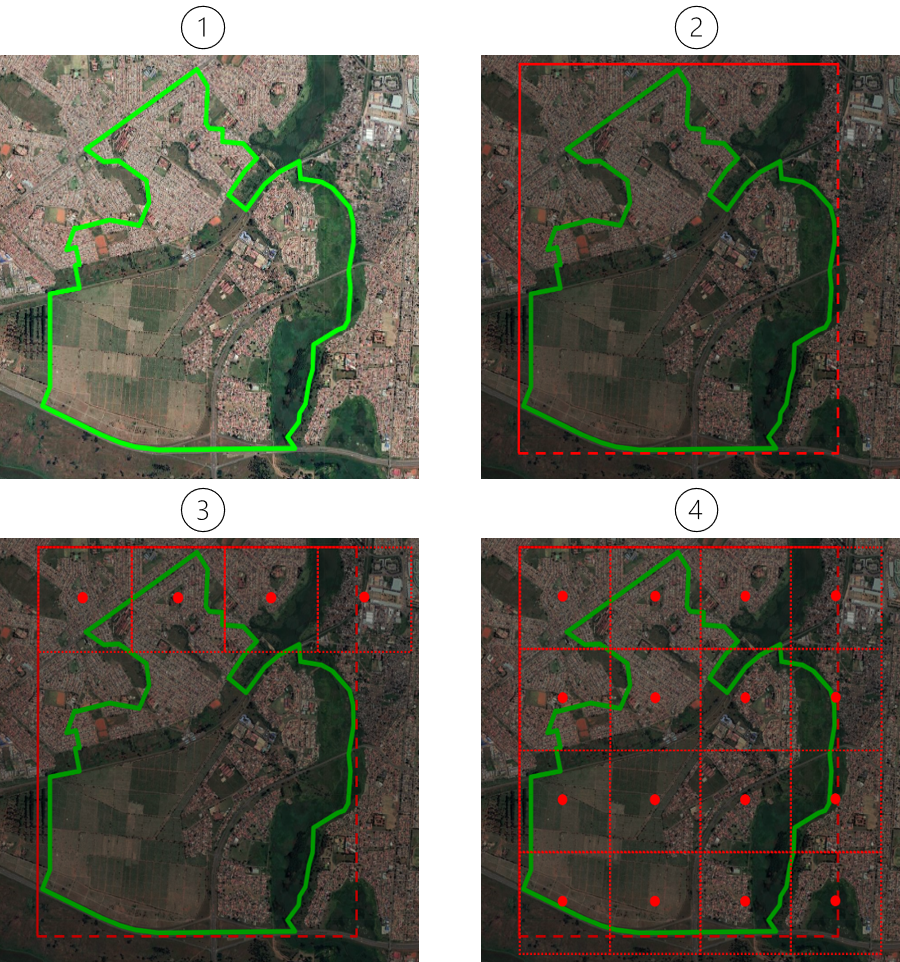
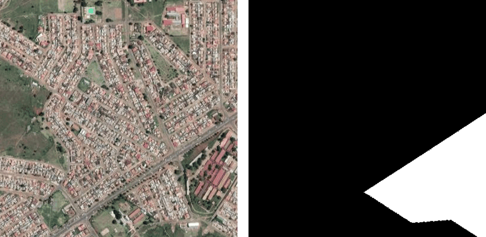
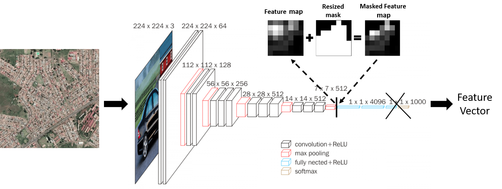

# Clustering of Ward Level Poverty through the use of Satellite-Imagery

This is the Github repo for the paper *Clustering Ward-Level Poverty Using Satellite Imagery* by Ryan Anderson and Andomei Smit. The aim of this research is to cluster Gauteng wards based on their level of poverty and, as a result, create a poverty map. Furthermore, the clustering will purely be based on publicly available data - assessing the potential for census-less poverty mapping. Since high-resolution satellite imagery is publicly-available, the wards will be clustered from the information that can be extracted from this imagery.

The general methodology followed in the paper is as follows:
* **Step 1:** Obtain a set of satellite images for each of the Gauteng wards
* **Step 2:** Extract a feature set for the wards from the satellite imagery using a pre-trained CNN
* **Step 3:** The dimensions of the features are reduced and then clustered using K-means and HDBSCAN

See the paper at <code>papers/Honours_Project_2020.pdf</code> for more information.

## Setup

In order to install the necessary packages, it is recommended to use the file *environment.yml*. To do this, run the following command in the repo: 
```
conda env create -f environment.yml
```
Then activate the environment *honoursprojectenv* by running the following:
```
conda activate honoursprojectenv
```
Then make sure you are running a kernel associated with this environment by first running:
```
conda install -c anaconda ipykernel
```
Then run:
```
python -m ipykernel install --user --name=honoursprojectenv
```
If you get any import errors, click on the "Kernel" tab at the top of the notebook and change the kernel to the *honoursprojectenv* kernel.

Unfortunately, for the R scripts, you will have to install the necessary packages yourself.

## Scripts

### feature_extraction

<code>get_ward_boundaries.ipynb</code>:
Reads in the shapefile for all of the wards in South Africa and outputs the wards for each of the Gauteng municipalities.

<code>get_image_centers.ipynb</code>:
Reads in the coordinates for the Gauteng wards from the shapefiles, and computes the centers for the images that need to be extracted. This is done by sampling coordinates from a grid of images that cover the ward of interest. For an illustration, see the figure below:



<code>get_images.ipynb</code>:
Using the centers from <code>get_image_centers.ipynb</code>, this script requests three images from Google Static Maps API for each of the center coordinates - one with the ward overlayed in black and green, and one without. For each ward, the output of the algorithm is a number of image-pairs comprised of (1) a plain satellite image and (2) an image mask, with the white region of the mask outlining the area of the satellite image that falls within the ward of interest. An example can be seen below:



<code>get_features.ipynb</code>:
This script implements the methodology used to map each plain satellite image, with the aid of its corresponding mask, to a set of features. This involves modifiying the VGG11 model to include "convolutional masking layer". An illustration of the modified CNN can be seen below:




### clustering

<code>pca.ipynb</code>:
INSERT EXPLANATION HERE.

<code>kmeans_clustering.ipynb</code>:
INSERT EXPLANATION HERE.

<code>hdbscan_clustering.ipynb</code>:
INSERT EXPLANATION HERE.

<code>umap_clustering.ipynb</code>:
INSERT EXPLANATION HERE.


### visualisation_validation

<code>visualizing_clusters.R</code>:
INSERT EXPLANATION HERE.

<code>interpolating_sampi.R</code>:
INSERT EXPLANATION HERE.

<code>validating_clusters.R</code>:
INSERT EXPLANATION HERE.


## Note on Scripts

You will need to get a Google Static Maps API key for for requesting images. For more information, see https://developers.google.com/maps/documentation/maps-static/overview.

